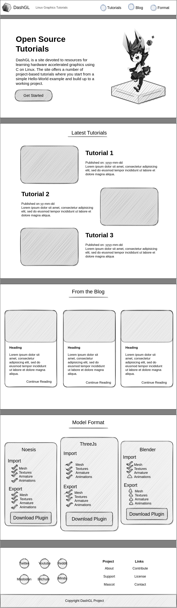
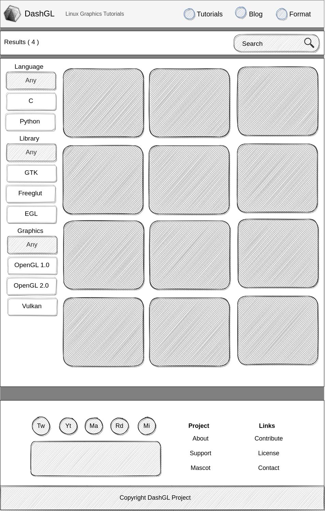
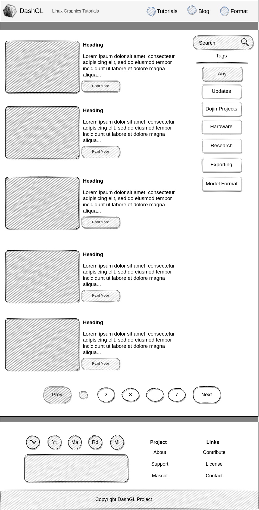
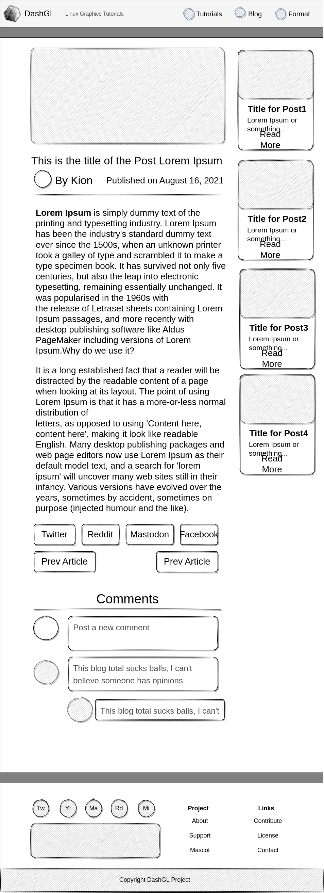

<p align="center">
	<a href="https://dashgl.com">
		
	</a>
</p>

<h1 align="center">
  DashGL Project
</h1>

This repository contains the source code for the live version of [dashgl.com](https://dashgl.com).
This repository is created with GatsbyJs using the Typescript template.


## Layout

The layout of DashGL is broken down into three main pages.

1. The landing page
2. Tutorial/Blog overview
3. Article View

Note that there is also a selection for tutorials, but with the current limited selection of
tutorials, this functionality likely isn't required at this point in time. 

<table width='100%'>
<tr>
	<td valign="top">
		
	</td>
	<td valign="top">
		
	</td>
	<td valign="top">
		
	</td>
	<td valign="top">
		
	</td>
</tr>
</table>

## 🚀 Quick start

1.  **Create a Gatsby site.**

    Use the Gatsby CLI to create a new site, specifying the minimal TypeScript starter.

    ```shell
    # create a new Gatsby site using the minimal TypeScript starter
    npm init gatsby
    ```

2.  **Start developing.**

    Navigate into your new site’s directory and start it up.

    ```shell
    cd my-gatsby-site/
    npm run develop
    ```

3.  **Open the code and start customizing!**

    Your site is now running at http://localhost:8000!

    Edit `src/pages/index.tsx` to see your site update in real-time!

4.  **Learn more**

    - [Documentation](https://www.gatsbyjs.com/docs/?utm_source=starter&utm_medium=readme&utm_campaign=minimal-starter-ts)

    - [Tutorials](https://www.gatsbyjs.com/tutorial/?utm_source=starter&utm_medium=readme&utm_campaign=minimal-starter-ts)

    - [Guides](https://www.gatsbyjs.com/tutorial/?utm_source=starter&utm_medium=readme&utm_campaign=minimal-starter-ts)

    - [API Reference](https://www.gatsbyjs.com/docs/api-reference/?utm_source=starter&utm_medium=readme&utm_campaign=minimal-starter-ts)

    - [Plugin Library](https://www.gatsbyjs.com/plugins?utm_source=starter&utm_medium=readme&utm_campaign=minimal-starter-ts)

    - [Cheat Sheet](https://www.gatsbyjs.com/docs/cheat-sheet/?utm_source=starter&utm_medium=readme&utm_campaign=minimal-starter-ts)

## 🚀 Quick start (Gatsby Cloud)

Deploy this starter with one click on [Gatsby Cloud](https://www.gatsbyjs.com/cloud/):

[](https://www.gatsbyjs.com/dashboard/deploynow?url=https://github.com/gatsbyjs/gatsby-starter-minimal-ts)
